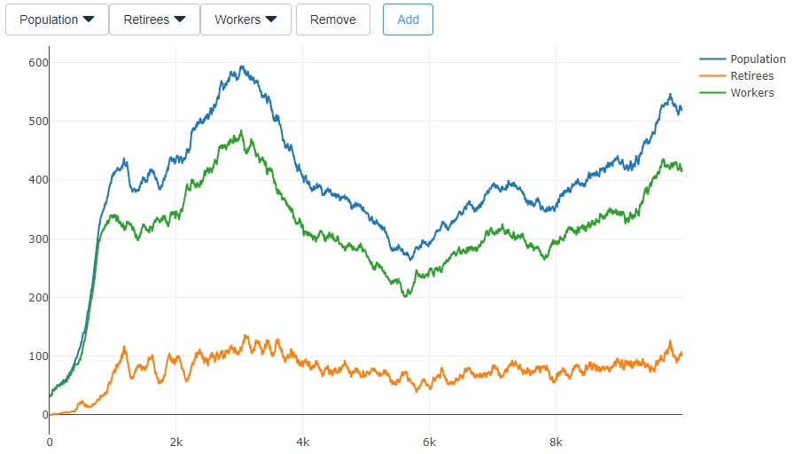

# Exercise 6 - Inflow and Outflow

This week's exercise is about the relation between prices on the stock market and the flow of investments. This exercise is about finding and verifying a good theory by analyzing a given data set. In the given scenario, the growth rate of the population is set equal to mortality on day 800, which leads to a population that should be stable from day 1500 on (the dependency ratio, i.e. the ratio between retirees and workers, needs a little longer to stabilize). So in expectation, the population should be flat from day 1500 on. But in most simulation runs, it is not, as growth is probabilistic. It follows a so-called random walk.

Random walks are highly important in finance, as they are often used to model the stock market. For example, they are essential when calculating the price of options. The basic idea of a random walk is that at each point in time, we probabilistically make a step in either direction and use the resulting new value as the starting point for the next step. It is mainly the demographics that drive stock market in the current exercise.

## Data

Your task is to find out how inflows and outflows drive the stock prices observed on the stock market. All the data you need for this exercise can be downloaded from [the simulation server](http://meissereconomics.com/vis/simulation?sim=ex6-flow&metric=stockmarket) (follow the link and click the download button).

In classic models with instantaneous market clearing, prices are calculated by assuming that inflows and outflows are equal at each point in time:

${inflow}_t = {outflow}_t$

whereas ${inflow}_t$ is the amount invested into the stock market and ${outflow}_t = {price}_t * n_t$, with $n_t$ being the number of shares that are sold on day $t$. This also hold in our model when including the trades of the market makers in the inflow and outflow. However, we want to know how the inflow and outflow of the consumers impact the stock market. Thus, the flows given in the data exclude those of the market maker. Under these circumstances, the above equation no longer holds, which you can easily verify by observing that ${inflow}_t \neq {outflow}_t$ in the provided data on most days.

The log returns provided are simple the daily percentage changes. The advantage of using log returns is that you can simply add them up to get cummulative returns, whereas percentage returns need to be multiplied.

$\frac{p_t}{p_{t-2}} = \frac{p_t}{p_{t-1} \frac{p_t-1}{p_{t-2} = e^{ln \frac{p_t}{p_{t-1} + ln \frac{p_t-1}{p_{t-2}}$

Economists often use log returns by default.

For the task at hand, you should **ignore all data before day 3000**. Also, you can ignore the data of the individual stocks and focus entirely on the index, which represents a weighted average of the two stocks. Volume represents the number of shares traded, but you can already get the full score without using volume data at all.

## Task 1: the long run

While the above equation clearly does not hold on single days, check whether it holds in the longer run. I.e. how high do you need to set $\delta$ for the following to hold approximately:

$\sum_{i=t}^{t+\delta} {inflow}_i \approx \sum_{i=t}^{t+\delta} {outflow}_i$

## Task 2: the short run

Regardless of the results you obtain in task 1, the question of how inflows and outflows is related to prices remains. Can you come up with an equation that describes this relation? It is clear that higher inflows will lead to higher prices, and higher outflows to lower prices, but how are they related exactly? In other words: given the price $p_{t-1}$, ${inflow}_t$ and ${outflow}_t$, can you come up with a rule to predict $p_t$?

To find and verify a good result, you will need to apply empirical methods using your [software of choice](https://www.uzh.ch/cmsssl/id/de/dl/sw/angebote/alle.html). To [do so in excel](http://www.excel-easy.com/examples/regression.html), you will need to install the [Analysis Toolpak add-in](http://www.excel-easy.com/data-analysis/analysis-toolpak.html).

Your rule should be simple, but also be statistically significant (t-stats above 10 are excellent, social scientists are usually already happy with a value of 2). Sometimes, it can help to reduce the noise by using a rolling average over multiple days instead of the data of individual days.

## Deliverables and deadline

Document your findings in the [lab journal](exercise06-journal.md), including an equation describing the relation between flows and prices, as well as the results of you statistic tests.

The deadline for submitting the lab journal to github is 2017-10-26 at 24:00.
