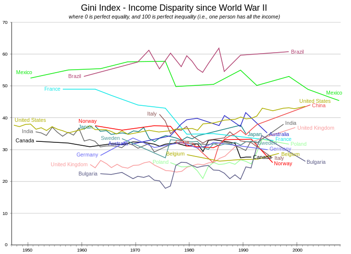

# Exercise 7 - Equality

One of the strength of agent-based models is their ability to allow for diversity. Instead of just having one representative consumer, we can have hundreds of individual consumers, that each have their own wealth, their own income, their own age, and even their own utility functions. This makes it straight-forward to measure inequality, as well as other metrics that are based on variation within the population.

In this exercise, you will test the effect of varying utility functions as well as varying life expectancy on equality, as measured by the [Gini coefficient](https://en.wikipedia.org/wiki/Gini_coefficient), which is the most common metrics to measure equality.

## Task 1

Let us start with a basic scenario based on the previous simulations. To reduce noise, the [demographics](http://meissereconomics.com/vis/simulation?sim=ex7-equality-basic&metric=demographics) are not random any more and the population kept constant after an initial growth phase. The [consumers](https://github.com/meisser/course/blob/ex7-equality-basic/simulation/src/com/agentecon/consumer/InvestingConsumer.java) are investing according to the optimal (corrected) investment rule, assuming a daily interest rate of 0.5%. They pick the stocks with the highest dividend yields, but disregard yields when selling them.

Looking at the [equality statistics](http://meissereconomics.com/vis/simulation?sim=ex7-equality-basic&metric=equality) of the basic scenario, you will notice that equality is much lower in the whole population than in each cohort individually! Overall, the wealth gini coefficient is at 0.44 or so, but for the individual cohorts, it is always around 0.1. Can you explain this difference?

## Task 2

## Data

Your task is to find out how inflows and outflows drive the stock prices observed on the stock market. All the data you need for this exercise can be downloaded from [the simulation server](http://meissereconomics.com/vis/simulation?sim=ex6-flow&metric=stockmarket) (follow the link and click the download button).

In classic models with instantaneous market clearing, prices are calculated by assuming that inflows and outflows are equal at each point in time:

${inflow}_t = {outflow}_t$

whereas ${inflow}_t$ is the amount invested into the stock market and ${outflow}_t = {price}_t * n_t$, with $n_t$ being the number of shares that are sold on day $t$. This also hold in our model when including the trades of the market makers in the inflow and outflow. However, we want to know how the inflow and outflow of the consumers impact the stock market. Thus, the flows given in the data exclude those of the market maker. Under these circumstances, the above equation no longer holds, which you can easily verify by observing that ${inflow}_t \neq {outflow}_t$ in the provided data on most days.

The log returns provided are simple the daily percentage changes. The advantage of using log returns is that you can simply add them up to get cummulative returns, whereas percentage returns need to be multiplied.

$\frac{p_t}{p_{t-2}} = \frac{p_t}{p_{t-1}} \frac{p_{t-1}}{p_{t-2}} = e^{ln \frac{p_t}{p_{t-1}} + ln \frac{p_{t-1}}{p_{t-2}}}$

Economists often use natural log returns by default and rarely ever convert back.

For the task at hand, you should **ignore all data before day 3000**. Also, you can ignore the data of the individual stocks and focus entirely on the index, which represents a weighted average of the two stocks. Volume represents the number of shares traded, but you can already get the full score without using volume data at all.

## Task 1: the long run

While the above equation clearly does not hold on single days, check whether it holds in the longer run by using rolling averages. I.e. how high do you need to set $\delta$ for the following to hold approximately:

$\frac{1}{\delta} \sum_{i=t}^{t+\delta} {inflow}_i \approx$

$\frac{1}{\delta} \sum_{i=t}^{t+\delta} {outflow}_i$

## Task 2: the short run

Regardless of the results you obtain in task 1, the question of how inflows and outflows is related to prices remains. Can you come up with an equation that describes this relation? It is clear that higher inflows will lead to higher prices, and higher outflows to lower prices, but how are they related exactly? In other words: given the price $p_{t-1}$, ${inflow}_t$ and ${outflow}_t$, can you come up with a rule to predict $p_t$?

To find and verify a good result, you will need to apply empirical methods using your [software of choice](https://www.uzh.ch/cmsssl/id/de/dl/sw/angebote/alle.html). To [do so in excel](http://www.excel-easy.com/examples/regression.html), you will need to install the [Analysis Toolpak add-in](http://www.excel-easy.com/data-analysis/analysis-toolpak.html).

Your rule should be simple, but also be statistically significant (t-stats above 10 are excellent, social scientists are usually already happy with a value of 2). Sometimes, it can help to reduce the noise by using a rolling average over multiple days instead of the data of individual days.

## Deliverables and deadline

Document your findings in the [lab journal](exercise06-journal.md), including an equation describing the relation between flows and prices, as well as the results of you statistic tests.

The deadline for submitting the lab journal to github is 2017-11-02 at 24:00.
