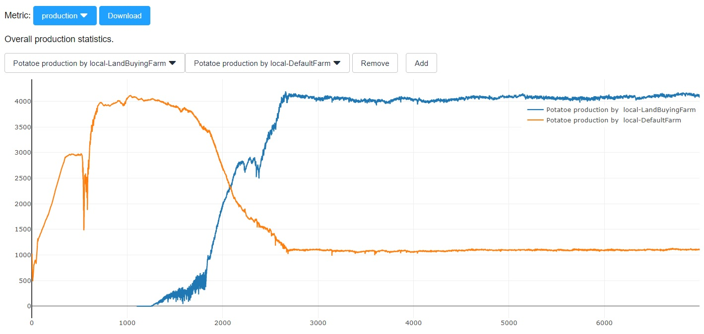
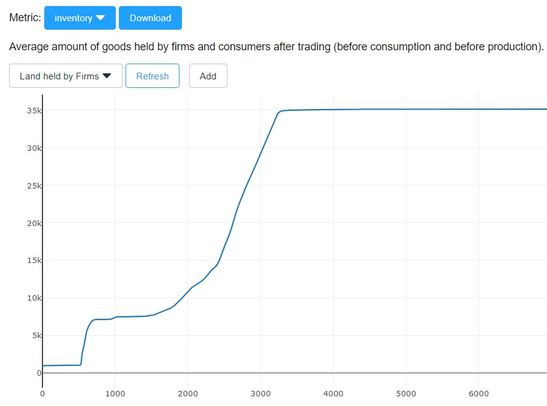
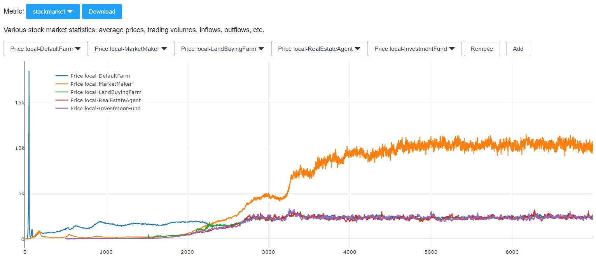

# Final Exercise

We are extending our model to capital, introducing three new agent types.

## Task

Depending on which agent you have chosen, you should either implement the [RealEstateAgent](../src/com/agentecon/exercise9/RealEstateAgent.java), the
[LandBuyingFarm](../src/com/agentecon/exercise9/LandBuyingFarm.java), or the [InvestmentFund](../src/com/agentecon/exercise9/InvestmentFund.java). There are two teams for each agent types. A more detailed description can be found in the classes themselves as well as in the slides of lesson 9.

The agents will be ranked by total dividend paid to consumer shareholders. However, this metric is only useful within an agent type. The ranking based on this metric is not online yet.

## Notes

I have refined the basic scenario to make sure the default implementation of every agent does something reasonable.

Here is a number of comments and modifications I made:

* My provided DefaultFarm exists from the beginning as before, but now it also trades some land (selling it for too cheap). This helps establishing a market for land.
* Your custom farms, the LandBuyingFarms, do not enter the simulation before day 1000. At this point in time, the funds and the real estate agents should already be active, making decision taking easier.
* LandBuyingFarm: The provided implementation is far from optimal, but it manages to overtake the DefaultFarm quickly when looking at production:

* LandBuyingFarm: I made the raising of money more explicit in the raiseCapital function.
* In order to make ensure a basic level of demand for the stocks of the new farms, I let the investment funds invest 10% of their budget into young firms.
* As inspired by a student, the funds now have much more information available to base their investment decision on (see sample code in the latest version).
* I adjusted the parameters of production function of the real estate agent, it is now: $0.3 h^{0.8}$. The curve is now flatter in the beginning, but less flat later. Total land production in the base case is about 35000 units:

* The default land price of the real estate agent now is only 100 - way too cheap. There is some land production for a while, but it dies off later. This should change one the farms start to invest more heavily into land.
* Right now, the stock market looks quite boring after a while. However, there is quite some room for speculation when the better farms start to arrive in the market.

* The available statistics are not optimal yet. I plan to improve them over the course of the week. Let me know if you want some particular data that is currently not readily available.

As discussed, half of the next lecture will be dedicated to discussing your ideas and helping you with your agents. Getting a simulation (or any larger software) running nicely with so many contributing parties is not trivial. But I am here to help.

## Deliverables and deadline

The deliverables for your final exercise are the code of your agent as well as the presentation on the scheduled day. The deadline for the presentation is the day on which it is held. It should be clear which author is responsible for which part of the presentation. Computer scientist should focus on the economic aspects and vice versa. The deadline for the code is December 14th.
